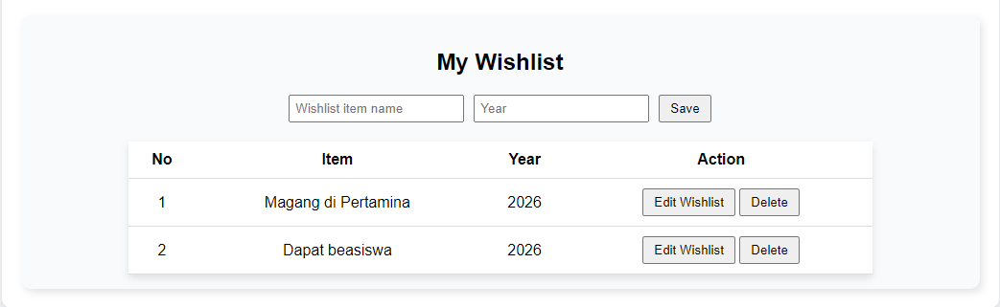

# My Wishlist App

## Deskripsi Singkat
Aplikasi **HypoWishlist** adalah sebuah aplikasi personal dashboard yang menampilkan informasi pribadi, serta digunakan untuk menyimpan, menampilkan, mengubah, dan menghapus daftar wishlist pribadi. Semua data disimpan di **localStorage**, sehingga tetap tersimpan meskipun halaman direfresh.

### Fungsi Aplikasi
- Menambahkan item wishlist baru.
- Mengedit item wishlist yang sudah ada.
- Menghapus item wishlist.
- Menampilkan daftar wishlist dalam bentuk tabel.

## Screenshot Aplikasi

## Fitur ES6+ yang Diimplementasikan
- **Class Syntax**: `class WishlistItem` untuk membuat objek wishlist dan metode render.
- **Template Literals**: Digunakan untuk membuat HTML dinamis di metode `render()`.
- **Arrow Functions**: Digunakan di `renderWishlist`, `showMessage`, dan beberapa callback.
- **let/const**: Untuk deklarasi variabel.
- **Array Methods**: `forEach`, `find`, `findIndex`, `filter` digunakan untuk manipulasi array `wishlist`.
- **Async/Await & Promise**: Digunakan di `saveWishlist` untuk simulasi penyimpanan data asinkron.
- **LocalStorage API**: Menyimpan dan mengambil data dari browser storage.

## Cara Penggunaan
1. Clone atau download repository ini.
2. Buka file `index.html` di browser.
3. Tambahkan item wishlist baru menggunakan form.
4. Gunakan tombol **Edit Wishlist** untuk mengubah data dan **Delete** untuk menghapus item.

