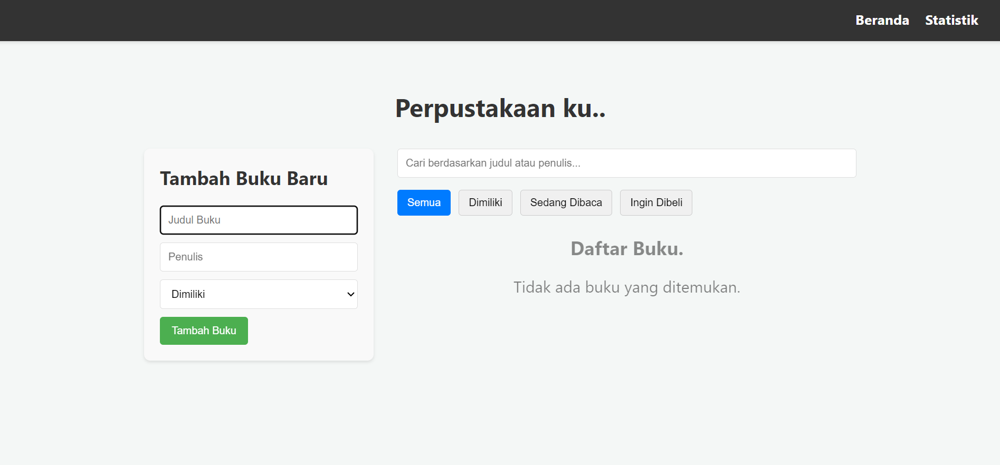
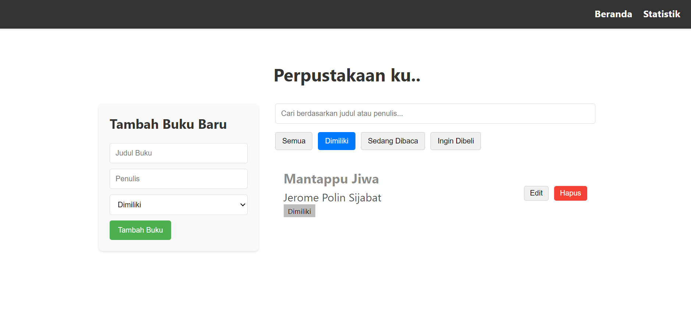
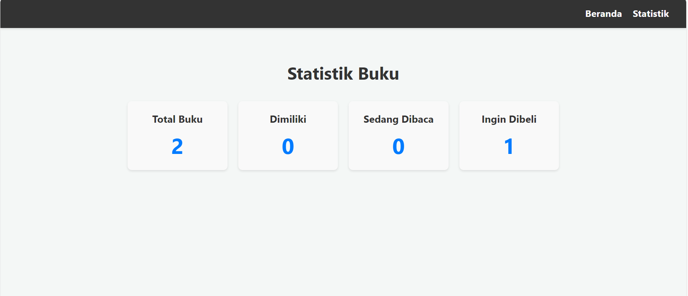
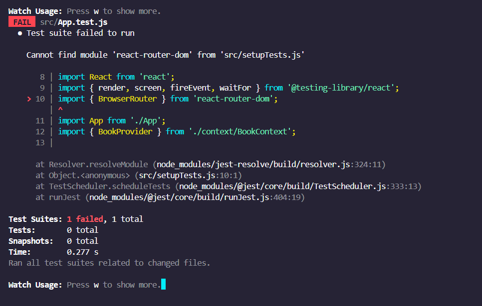
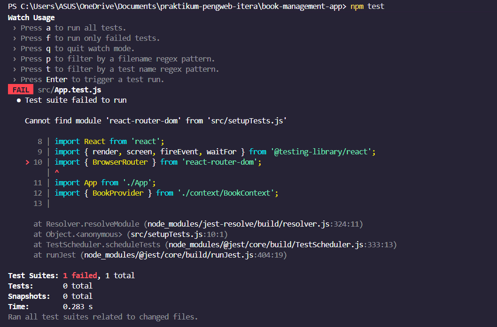
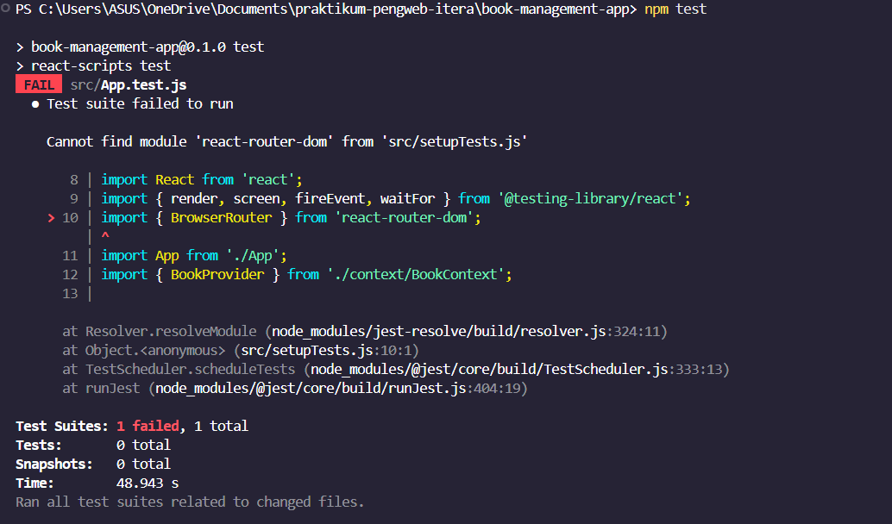

Berikut versi lengkap README dengan bagian **cara clone repository** ditambahkan di bagian “Instalasi”:

---

````markdown
# 📚 Aplikasi Manajemen Buku Pribadi

Sebuah aplikasi web berbasis **React.js** yang memungkinkan pengguna untuk mengelola koleksi buku pribadi mereka.  
Dengan aplikasi ini, Anda dapat mencatat buku yang **sudah dimiliki**, **sedang dibaca**, atau **ingin dibeli**, serta mengelola data tersebut dengan mudah.

---

## 🚀 Cara Memulai

### 🧩 Prasyarat
Pastikan Anda telah menginstal:
- [Node.js](https://nodejs.org/)
- npm (Node Package Manager)

---

### ⚙️ Instalasi

1. **Clone repositori ini**

Setelah proses clone selesai, buka folder proyek dengan perintah:

```bash
cd book-management-app
```

2. **Instal semua dependensi**

   Jalankan perintah berikut untuk mengunduh semua package yang diperlukan:

   ```bash
   npm install
   ```

---

### ▶️ Menjalankan Aplikasi

Untuk memulai server pengembangan, jalankan:

```bash
npm start
```

Aplikasi akan terbuka otomatis di browser Anda pada alamat:

```
http://localhost:3000
```

---

### 🧪 Menjalankan Testing

Gunakan perintah berikut untuk menjalankan unit test:

```bash
npm test
```

Perintah ini akan menjalankan test dalam mode **watch**, yang berarti test akan dijalankan ulang setiap kali ada perubahan pada file.
Tekan `q` untuk keluar dari mode watch.

---

## 📸 Screenshots Antarmuka

```markdown





```

---

## ⚛️ Penjelasan Fitur React yang Digunakan

Aplikasi ini dibangun menggunakan fitur-fitur modern React:

### 🔹 Functional Components & Hooks

Seluruh komponen dibuat menggunakan **fungsi JavaScript (functional components)** yang ringkas dan mudah dipelihara.
State dan lifecycle dikelola dengan **React Hooks**.

#### Hooks yang digunakan:

* **useState** → Mengelola state lokal dalam komponen (form input, filter, mode edit).
* **useEffect** → Menangani side-effect seperti memperbarui state ketika prop berubah.
* **useMemo** → Mengoptimalkan performa dengan menyimpan hasil perhitungan (memoization).

---

### 🧰 Custom Hooks

#### `useLocalStorage.js`

Menyimpan dan mengambil data dari `localStorage` agar data pengguna **tidak hilang saat refresh**.

#### `useBookStats.js`

Menghitung statistik buku (total, dimiliki, dibaca, ingin dibeli) dari daftar buku.

---

### 🧠 Context API (`BookContext.js`)

Mengelola **state global** daftar buku dan fungsi manipulasi data:

* `addBook()`
* `editBook()`
* `deleteBook()`

Semua state ini dapat diakses oleh komponen mana pun tanpa harus mengoper props berulang-ulang (prop drilling).

---

### 🗺️ React Router

Digunakan untuk navigasi multi-halaman (**Single Page Application**):

* `/` → Halaman **Beranda**
* `/stats` → Halaman **Statistik**

Navigasi dilakukan dengan mulus tanpa reload halaman.

---

## 🧪 Laporan Testing

Aplikasi telah diuji menggunakan **React Testing Library** dan **Jest**.

### Test mencakup:

* Render komponen halaman utama
* Penambahan buku baru
* Penghapusan buku
* Filter berdasarkan status buku
* Pencarian buku

### Hasil uji:

```markdown





```

---

## 🧑‍💻 Teknologi yang Digunakan

* React.js
* React Router
* Context API
* Custom Hooks
* LocalStorage
* Jest & React Testing Library

---

## 📄 Lisensi

Proyek ini bersifat **open-source** — Anda bebas mengembangkan, memodifikasi, dan menggunakan kode ini sesuai kebutuhan.

---

```

---

```
