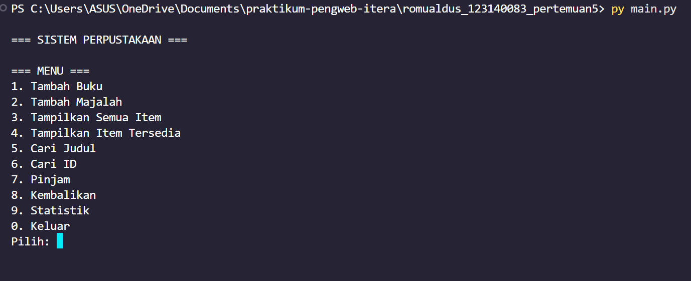
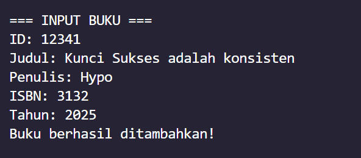

# Sistem Manajemen Perpustakaan

**Nama**: Romualdus Hary Prabowo
**NIM**: 123140083
**Kelas**: RA

## Deskripsi Program
Program ini adalah sistem manajemen perpustakaan sederhana yang dibuat dengan menggunakan konsep Object-Oriented Programming (OOP) pada Python. Program dapat mengelola koleksi buku dengan fitur peminjaman dan pengembalian.

## Fitur Program
1. Menambah Buku
2. Menampilkan semua item perpustakaan
3. Menampilkan item yang tersedia
4. Mencari item berdasarkan judul
5. Mencari item berdasarkan ID
6. Peminjaman item
7. Pengembalian item
8. Melihat statistik 

## Konsep OOP yang Diterapkan

### 1. Abstract Class dan Inheritance
- `BaseItem` sebagai kelas abstrak untuk item perpustakaan
- `Book` dan `Magazine` turunan dari `BaseItem`
- Implementasi abstract methods: `info()` untuk menampilkan detail item dan `category()` untuk mengembalikan jenis item

### 2. Encapsulation
Pengamanan atribut menggunakan private dan protected attribut:
**Private** → `__code`, dan `__name`
**Protected**  → `_release_year`, `_available`, dan `_borrow_time`

### 3. Property Decorators
Program menggunakan @property untuk membuat getter/setter yang aman dengan validasi.

Contoh:
**Getter-only**
@property
def item_code(self):
    return self.__code

**Getter + Setter dengan validasi**
@property
def title(self):
    return self.__name

@title.setter
def title(self, val):
    if not val.strip():
        raise ValueError("Judul tidak boleh kosong!")
    self.__name = val


### 4. Polymorphism
- Perbedaan implementasi method info() di Book dan Magazine
- Method __str__() di setiap subclass memberikan format output berbeda

- Library menggunakan duck typing, tidak peduli apakah objek itu Book atau Magazine, asalkan punya method yang sama (category(), is_available, dll)

## Struktur File
```
├── library_item.py    
├── book.py           
├── magazine.py       
├── library.py        
├── main.py           
└── README.md       
```

## Cara Menjalankan Program

1. Pastikan Python 3.x sudah terinstall
2. Buka terminal/command prompt
3. Jalankan program:
```bash
python main.py
```

## Screenshot Program




## Contoh Penggunaan

### Menambah Buku
```
ID: A123
Judul: Belajar Pemrograman
Penulis: Hypo
ISBN: 978-111-222-12
Tahun: 2021
```

### Mencari Item
```
Judul: MTK
Hasil: Menampilkan semua item yang mengandung kata "MTK"
```

### Meminjam Item
```
ID: A123
Output: Berhasil meminjam: Belajar Pemrograman
```

## Konsep Teknis

### Encapsulation
Private methods seperti `__find_by_id()` di Library class tidak dapat diakses dari luar, memastikan data integrity.

### Inheritance
Book dan Magazine mewarisi semua atribut dan method dari LibraryItem, menambahkan atribut spesifik mereka sendiri.

### Polymorphism
Setiap subclass mengimplementasikan `display_info()` dengan cara yang berbeda sesuai kebutuhan.